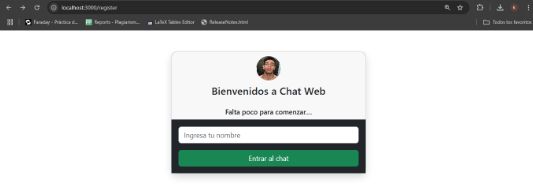
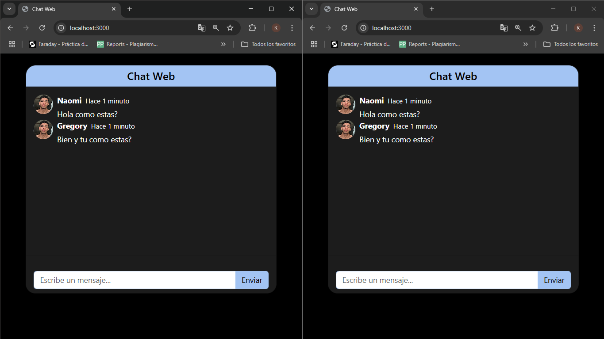
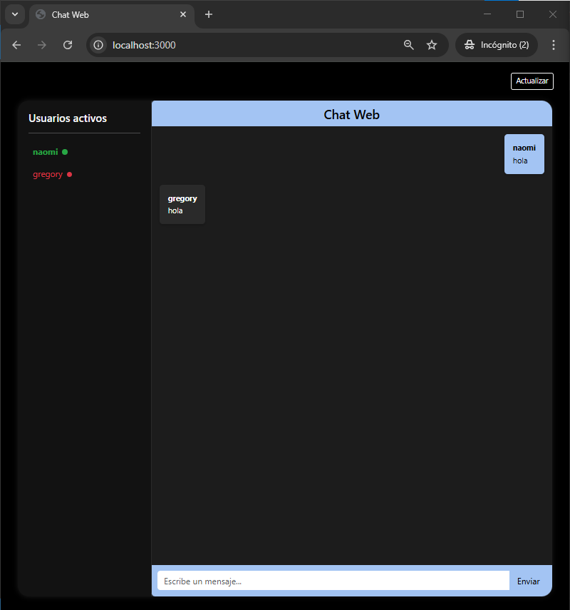
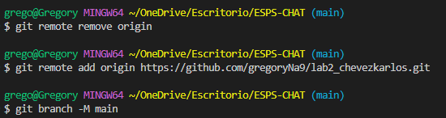

# Chat en Tiempo Real con Lista de Usuarios Conectados con Sockets

**Estudiante:** Karlos Gregory Chevez Bazán
**Fecha de entrega:** 30 de mayo de 2025

Este proyecto representa una mejora al sistema de chat implementado en la Tarea 2. Ahora, se ha incorporado una sección que muestra en tiempo real los usuarios conectados, permitiendo visualizar el estado de conexión en múltiples dispositivos o pestañas, al estilo de plataformas como WhatsApp o Telegram.

Repositorio del proyecto:
    [https://github.com/gregoryNa9/lab2_chevezkarlos.git](https://github.com/gregoryNa9/lab2_chevezkarlos.git)

---

## Características Implementadas

- Visualización dinámica de usuarios conectados.
- Sincronización en tiempo real con `Socket.IO`.
- Interfaz basada en `HTML`, `CSS` y `JavaScript`.
- Backend implementado con `Node.js`.

---

## Capturas del Proyecto

### Registro de Usuario


### Chat en tiempo real


### Usuario desconectado


### Usuario desconectado desde el servidor


### Navegación del proyecto


---

## Pruebas Realizadas

Durante el desarrollo de la funcionalidad de visualización de usuarios conectados en tiempo real, se llevaron a cabo diversas pruebas con múltiples usuarios y dispositivos. Estas pruebas permitieron validar el correcto funcionamiento de la aplicación. A continuación, se describen los casos evaluados:

Usuario A se conecta:
El sistema debía mostrarlo en la lista de conectados.
Resultado obtenido: Usuario A aparece correctamente.

Usuario B se conecta simultáneamente:
Ambos usuarios (A y B) debían visualizarse mutuamente en la lista.
Resultado obtenido: Ambos se visualizan en tiempo real como conectados.

Usuario A cierra la pestaña del navegador:
El usuario A debía desaparecer de la lista de conectados.
Resultado obtenido: La lista se actualiza correctamente y el usuario A ya no figura.

Usuario C se conecta desde otro equipo:
La lista de usuarios conectados debía sincronizarse correctamente en todos los dispositivos.
Resultado obtenido: Todos los dispositivos muestran una lista sincronizada sin errores.

Estas pruebas confirman que la lógica de conexión, desconexión y sincronización en tiempo real mediante Socket.IO está correctamente implementada.

## Instalación y Ejecución

### Clonar el Repositorio
   

```bash
git clone https://github.com/gregoryNa9/lab2_chevezkarlos.git

Instalar Dependencias

npm install

Iniciar el Servidor

Iniciar el Servidor
```

## Estructura del Proyecto

lab2_chevezkarlos/
├── node_modules/
├── public/
│   ├── img/
│   │   ├── accesoNav.png
│   │   ├── chatTR.png
│   │   ├── Clonar-Repositorio.png
│   │   ├── Foto.jpg
│   │   ├── iniciarServe.png
│   │   ├── instalarDep.png
│   │   ├── registroUser.png
│   │   ├── userOff.png
│   │   ├── userOffServe.png
│   ├── css/
│   └── js/
├── views/
├── routes/
├── middlewares/
├── index.js
├── realTimeServer.js
├── package.json
├── README.md

## Autor

Karlos Gregory Chevez Bazán
Estudiante de Ingeniería en Tecnologías de la Información
Universidad de las Fuerzas Armadas ESPE
Correo: kgchevez@espe.edu.ec